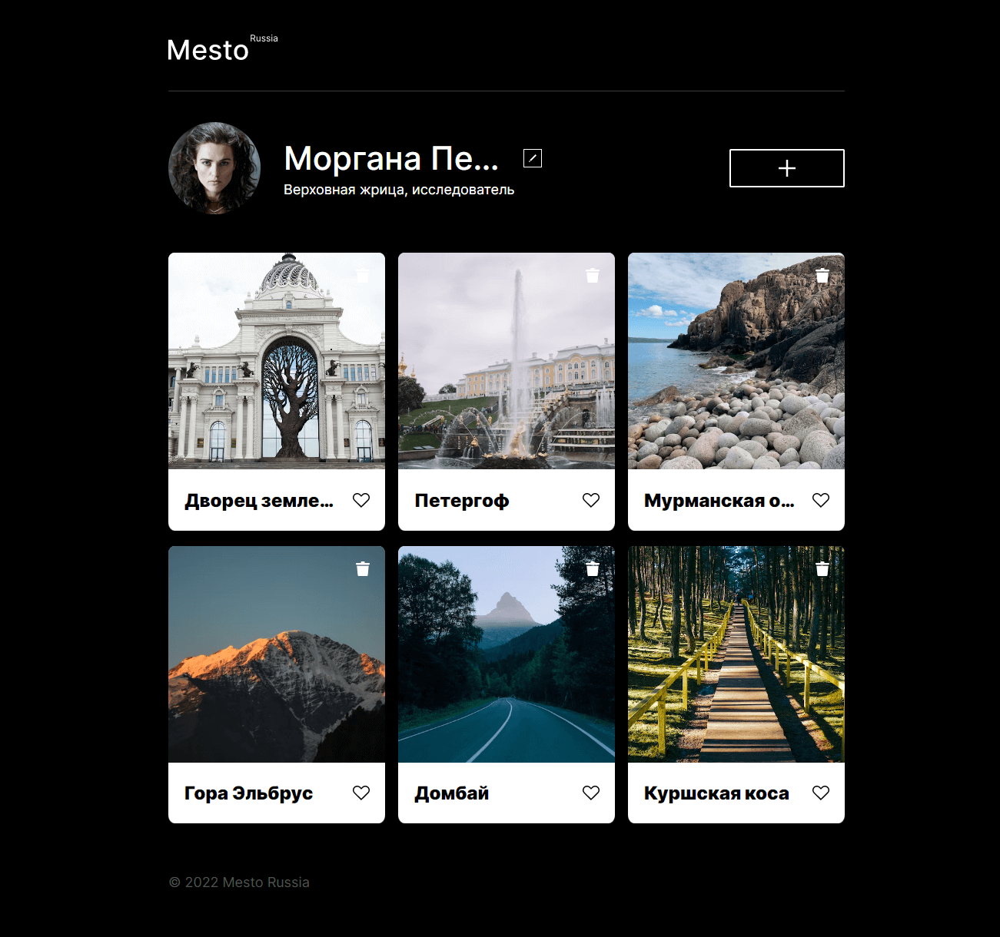
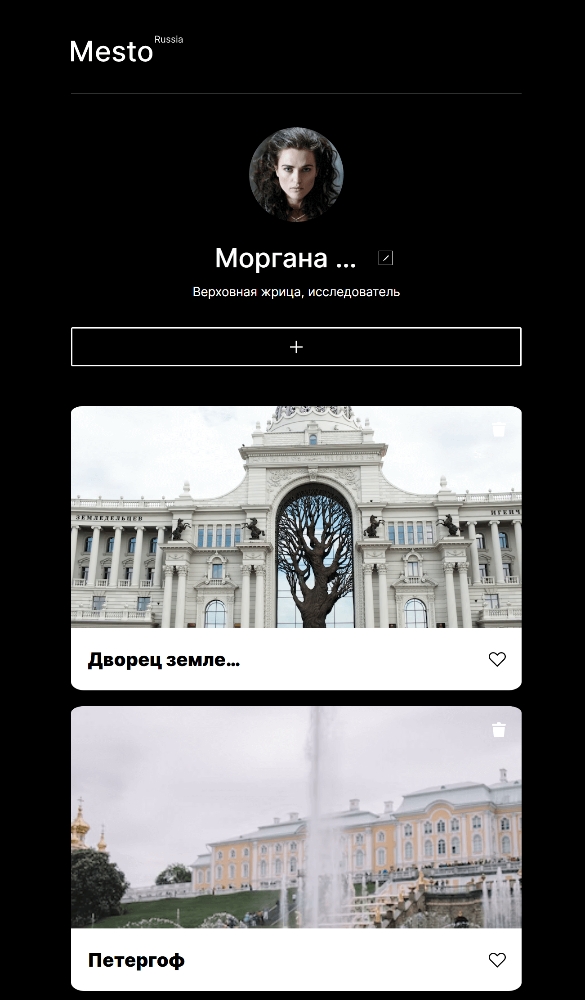
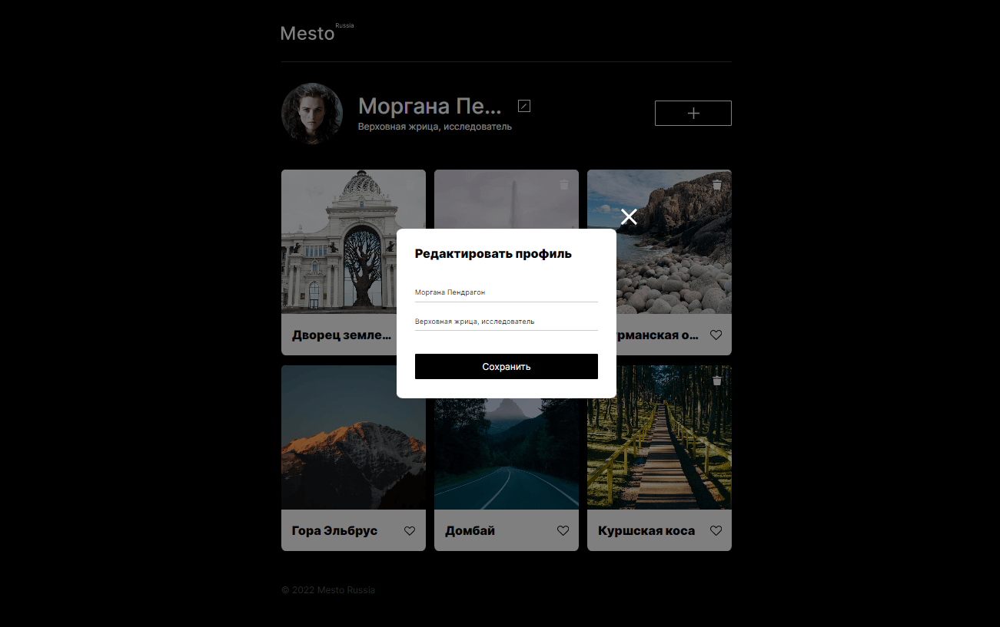
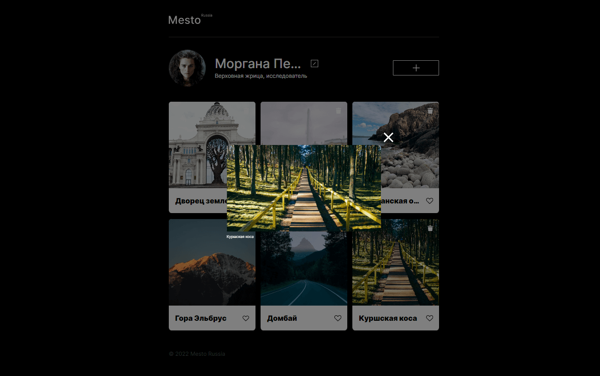
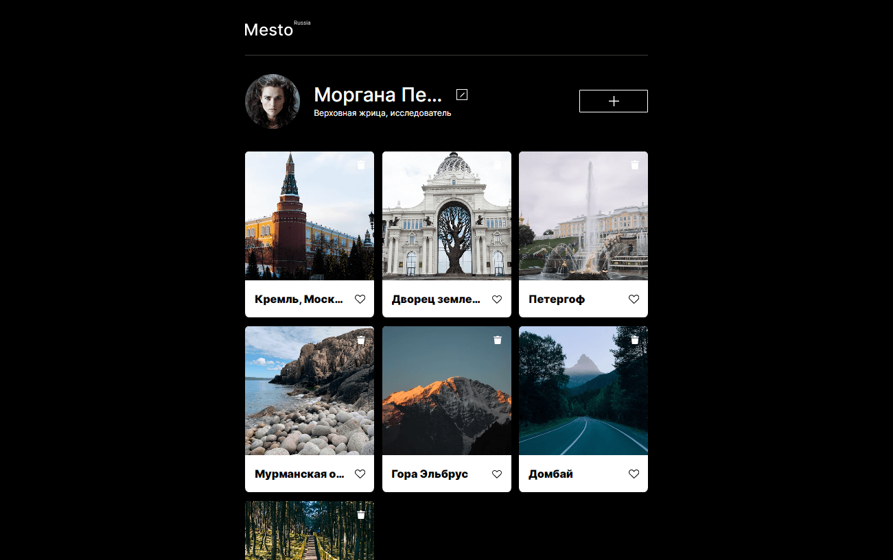
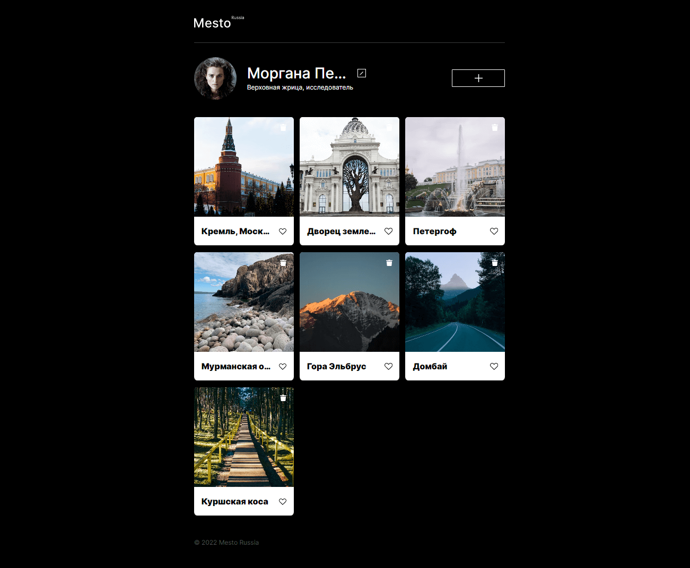
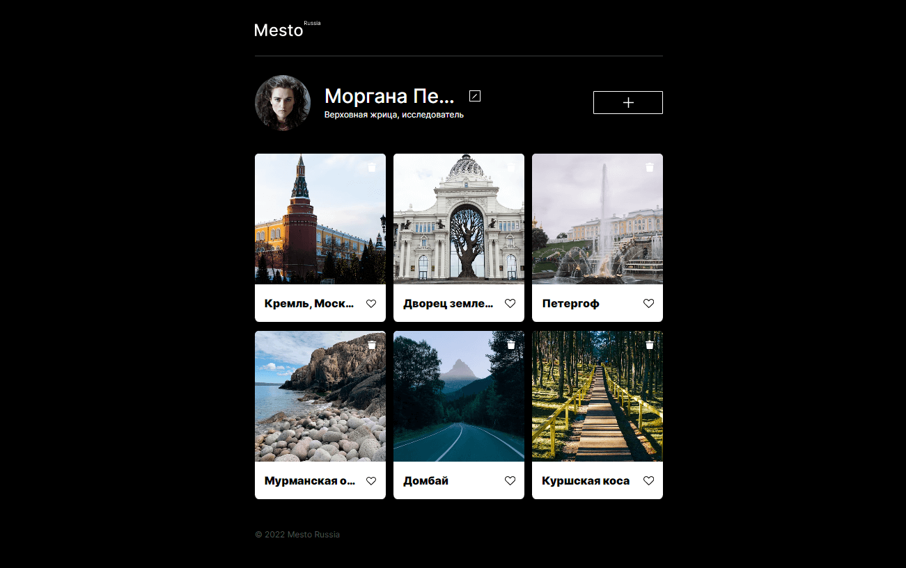
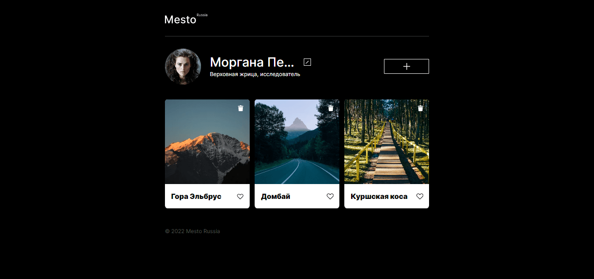

# Проект: Mesto
---
***Содержание файла README.md***

 
<a href="#description">Описание</a>
 
<a href="#figma">Ссылка на макет в Figma</a>
 
<a href="#demo">Демонстрация</a>
 
<a href="#file_structure">Файловая структура</a>
 
<a href="#technologies">Использованные технологии</a>
 
<a href="#functionality">Функциональность</a>

 
<h2>Описание</h2>

Данный проект реализован в рамках курсов от Яндекс.Практикум и представляет собой сервис Mesto: интерактивную страницу, куда можно добавлять фотографии, удалять их и ставить лайки. Для реализации используется дизайн-макет в Figma.

 
<h2>Ссылка на макет в Figma</h2> 
 

<a href="https://www.figma.com/file/2cn9N9jSkmxD84oJik7xL7/JavaScript.-Sprint-4?node-id=0%3A1">Макет 1</a> - в нем видно видно, как проект должен выглядеть на разрешениях экранов 320 и 1280 пикселей.

<a href="https://www.figma.com/file/bjyvbKKJN2naO0ucURl2Z0/JavaScript.-Sprint-5?node-id=0%3A1">Макет 2</a> - новая функциональность.

<h2>Демонстрация</h2> 
<h3>Ссылка на сайт <a href="https://almatanastasia.github.io/mesto/">тут</a> !</h3> 

❆ Pазрешение - 1280 пикселей
 
 

❆ Pазрешение - 320 пикселей
 

<h2>Файловая структура</h2> 
<pre>
.
├── blocks          # Файлы стилей блоков 
├── fonts           # Файлы шрифтов 
├── images          # Файлы изображений 
├── pages           # Файлы стилей страниц 
├── scripts         # Файлы скриптов страниц 
├── vendor          # Файлы сторонних библиотек 
├── .nojekyll       # Пустой файл для публикации на GitHub Pages 
├── README.md       # Файл документации проекта 
└── index.html      # Главная страница сервиса 
</pre>

<h2>Использованные технологии</h2> 

⬥ Работа с макетом в Figma 
⬥ Расширенные возможности HTML и CSS  
⬥ Технологии адаптивной верстки 
⬥ Файловая структура CSS по методолгии БЭМ (Nested) 
⬥ Базовый JavaScript (функции, массивы) 
⬥ Работа с DOM (методы addEventListener, querySelector) 
⬥ Изменение документа (создание, добавление и удаление элементов в DOM)

<h2>Функциональность</h2> 

✶ Шесть карточек
 

✶ Три формы
 

Форма редактирования профиля
 
 

Форма добавления новой карточки
 
 

Форма просмотра фотографий
 
 

✶ Добавление карточки
 

 

✶ Удаление карточки
 

 

✶ Лайк карточки
 

 

✶ Плавное открытие и закрытие попапов
 

**Картинки**

Доставать картинки Фигмы - расхожая практика, поэтому полезно потренироваться.
Нужно [оптимизировать картинки](https://tinypng.com/), чтобы сайт загружался быстрее.