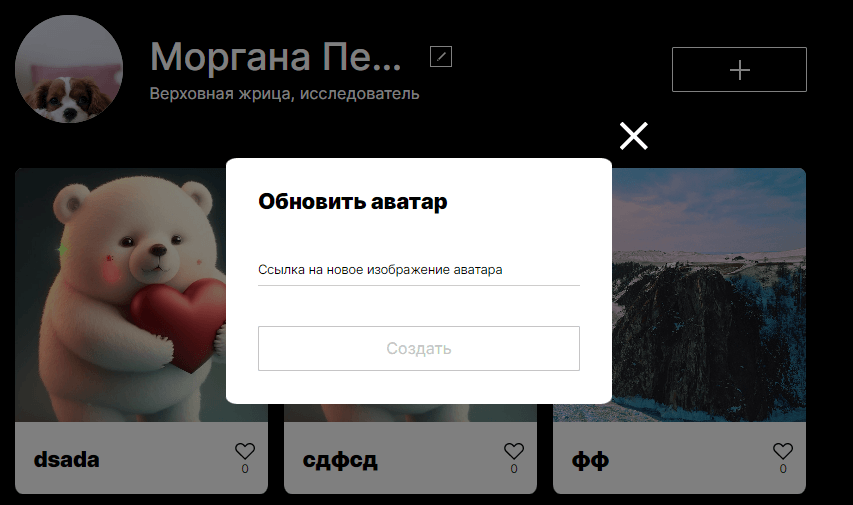
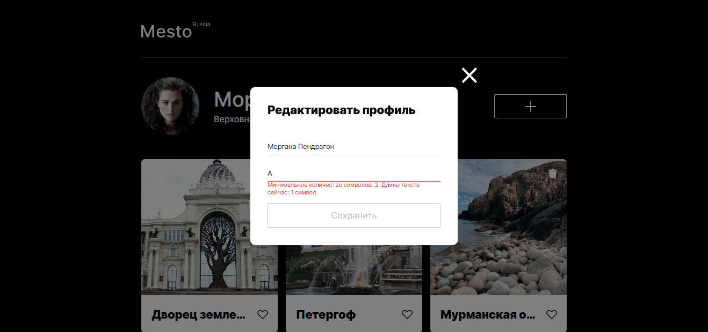
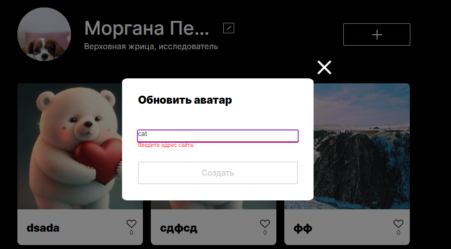
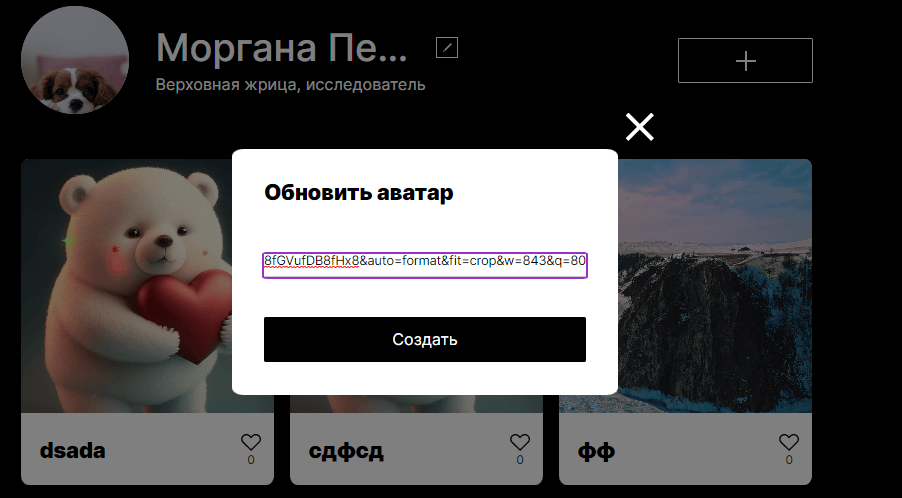

# Проект: Mesto
---
***Содержание файла README.md***

<a href="#description">Описание</a>
 
<a href="#figma">Ссылка на макет в Figma</a>
 
<a href="#demo">Демонстрация</a>
 
<a href="#file_structure">Файловая структура</a>
 
<a href="#technologies">Использованные технологии</a>
 
<a href="#functionality">Функциональность</a>

<h2>Описание</h2>

Данный проект реализован в рамках курсов от Яндекс.Практикум и представляет собой сервис Mesto: интерактивную страницу, куда можно добавлять фотографии, удалять их и ставить лайки. Для реализации используются дизайн-макеты в Figma.

<h2>Ссылка на макет в Figma</h2> 

<a href="https://www.figma.com/file/2cn9N9jSkmxD84oJik7xL7/JavaScript.-Sprint-4?node-id=0%3A1">Макет 1</a> - в нем видно видно, как проект должен выглядеть на разрешениях экранов 320 и 1280 пикселей.

<a href="https://www.figma.com/file/bjyvbKKJN2naO0ucURl2Z0/JavaScript.-Sprint-5?node-id=0%3A1">Макет 2</a> - новая функциональность, попапы.

<a href="https://www.figma.com/file/kRVLKwYG3d1HGLvh7JFWRT/JavaScript.-Sprint-6?node-id=0%3A1">Макет 3</a> - новая функциональность, валидация.

<a href="https://www.figma.com/file/PSdQFRHoxXJFs2FH8IXViF/JavaScript-9-sprint?node-id=0%3A1">Макет 4</a> - новая функциональность, попапы (подтверждение удаления, обновить аватар).

<h2>Демонстрация</h2>
<h3>Ссылка на сайт <a href="https://almatanastasia.github.io/mesto/">тут</a> !</h3>

❆ Pазрешение - 1280 пикселей

❆ Pазрешение - 320 пикселей

<h2>Файловая структура</h2>
<pre>
.
├── src                # HTML, CSS, JS-файлы и изображения 
├── .gitignore         # Файл для игнорирования/предотвращения передачи файлов 
├── README.md          # Файл документации проекта 
├── babel.config.js    # Файл с настройками Babel 
├── package-lock.json  # Файл блокировки, содержащий информацию о зависимостях/пакетах с их точными номерами версий 
├── package.json       # Файл управления версиями, используемый для установки нескольких пакетов в проекте 
├── postcss.config.js  # Файл для настроек PostCSS 
├── webpack.config.js  # Файл конфигурации Webpack
</pre>
<h2>Файловая структура директории src</h2>
<pre>
.
├── blocks          # Файлы стилей блоков 
├── components      # Файлы компонентов 
├── fonts           # Файлы шрифтов 
├── images          # Файлы изображений 
├── pages           # Файлы стилей страниц 
├── utils           # Файлы утилитарных модулей (отдельные функции и константы) 
├── vendor          # Файлы сторонних библиотек 
├── .nojekyll       # Пустой файл для публикации на GitHub Pages 
└── index.html      # Главная страница сервиса
</pre>

<h2>Использованные технологии</h2>

⬥ Работа с макетом в Figma 
⬥ Расширенные возможности HTML и CSS  
⬥ Технологии адаптивной верстки 
⬥ Файловая структура CSS по методолгии БЭМ (Nested) 
⬥ Базовый JavaScript (функции, массивы, объекты) 
⬥ Работа с DOM (методы addEventListener, querySelector) 
⬥ Изменение документа (создание, добавление и удаление элементов в DOM) 
⬥ Обработка событий 
⬥ Работа с формами, валидация форм 
⬥ Объектно-ориентированное программирование 
⬥ Рзбиение на модули 
⬥ Деструктуризация, слабая связь между классами 
⬥ Явная привязка контента методом bind 
⬥ Сборка проекта (Webpack) 
⬥ Транспиляция (Babel) 
⬥ Минификация CSS (PostCSS) 
⬥ Асинхронность 
⬥ Работа с API (метод fetch, формат JSON, методы HTTP) 
⬥ Методы HTTP (GET, POST, PUT, PATCH, DELETE)

<h2>Функциональность</h2>

✶ Шесть карточек

✶ Три формы

Форма редактирования профиля

Форма добавления новой карточки

Форма просмотра фотографий

Форма обновления аватара пользователя

Форма подтверждения (удалить фотографию)

✶ Добавление карточки

 

✶ Удаление карточки

 

✶ Лайк карточки

 

✶ Плавное открытие и закрытие попапов

✶ Лайв-валидация («Живая» валидация)

Валидация формы «Редактировать профиль»

 

Валидация формы «Новое место»

 

Валидация формы «Обновить аватар»

 

Четыре состояния кнопки отправки формы: обычное, при наведении, disabled и ожидания ответа от сервера

Попап закрывается по в клику любом месте вне этого окна и по нажатию на Esc

Закрытие попапа кликом на оверлей

Закрытие попапа нажатием на Esc

**Картинки**

Доставать картинки Фигмы - расхожая практика, поэтому полезно потренироваться.
Нужно [оптимизировать картинки](https://tinypng.com/), чтобы сайт загружался быстрее.